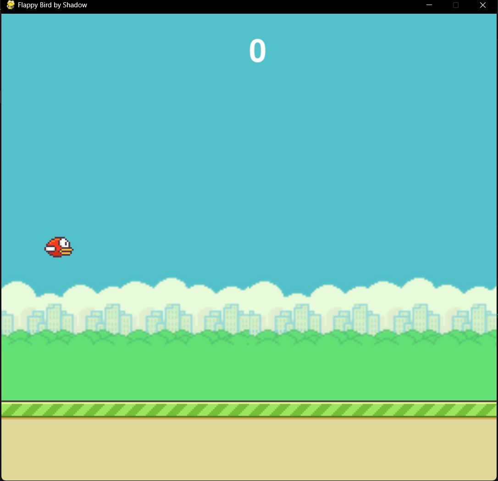
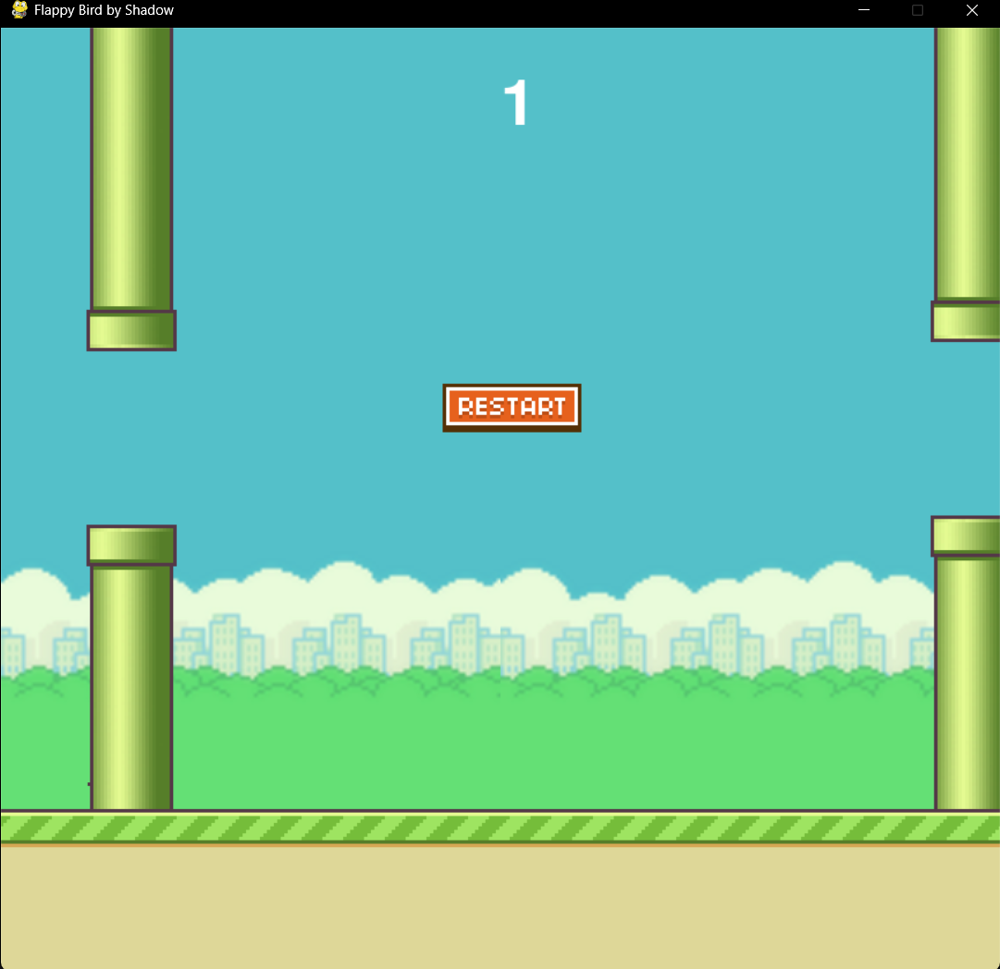

# Flappy Bird by Shadow 🐦

A simple Flappy Bird clone built with **Python** and **Pygame**.

---

## 

## 

## Features

- Classic Flappy Bird gameplay
- Smooth animations
- Restart button
- Score tracking

---

## Requirements

- Python 3.8+
- [Pygame](https://www.pygame.org/news) library

---

## Installation

1. **Clone this repository**

```bash
git clone https://github.com/the-last-monarch/flappy-bird-in-python.git
cd flappy-bird-in-python
```

2. **Install dependencies**

```bash
pip install -r requirements.txt
```

3. **Run game**

```bash
python main.py
```
